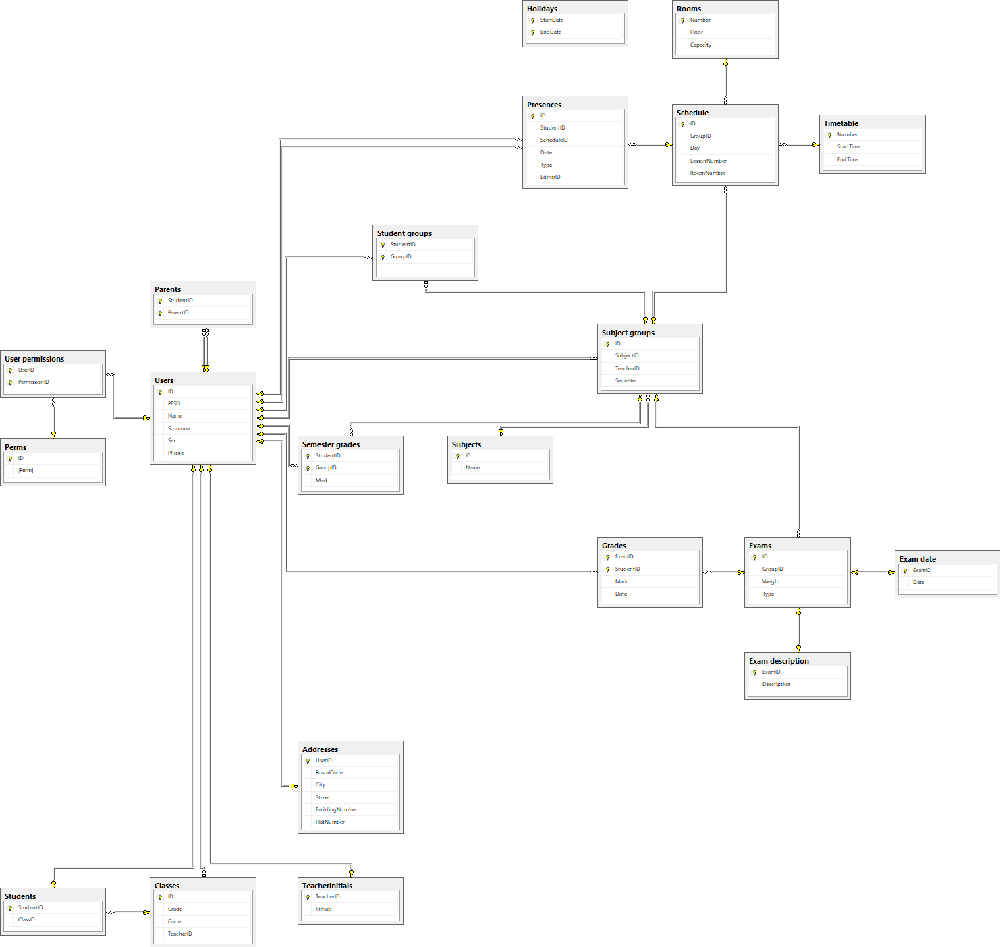

# Baza danych szkoły

## Założenia
Realizacja bazy danych szkoły przechowująca podstawowe informacje z dziennika szkolnego - E-dziennik. Przechowuje takie informacje jak dane o użytkownikach, przedmioty, grupy przedmiotowe, plany zajęć, oceny ucznia i jego obecności na zajęciach. Uczniowie jednej klasy mogą uczęszczać do różnych grup zajęciowych (np. języki obce). Dodatkowym celem była minimalizacja redundancji danych oraz zadbanie by mechanizmy kontrolujące spójność bazy danych.

## Ograniczenia
+ Obsługuje maksymalnie 26 klas na rocznik
+ Co rok szkolny baza danych jest ponownie budowana
+ Numery domów w adresie nie mogą zawierać liter

## Strategia pielegnacji bazy danych
Codziennie o północy różnicowa kopia zapasowa, co tydzień pełna kopia zapasowa bazy danych. Na zakończenie roku baza danych jest archwizowana.

## Schemat bazy danych (diagram relacji)


## Tabele

1. Użytkownicy -
Przechowuje dane wrażliwe o każdym użytkowniku - nauczyciel, uczeń, rodzic. Do jakich danych dostęp ma użytkownik zależy od jego uprawnień. Sprawdzana jest poprawność danych.
	```sql
	CREATE TABLE Users(
		ID int IDENTITY(1,1) PRIMARY KEY,
		PESEL char(11) UNIQUE NOT NULL, /* all users have to have a PESEL number */
		Name nvarchar(32) NOT NULL,
		Surname nvarchar(32) NOT NULL,
		Sex char(1) NOT NULL,
		Phone char(9),
		CHECK (LEN(PESEL) = 11),
		CHECK (LEN(Phone) = 9), /* only polish numbers */
		CHECK (Sex LIKE '[FM]')
	);
	```

1. Adresy użytkowników
	```sql
	CREATE TABLE Addresses(
		UserID int FOREIGN KEY REFERENCES Users(ID) ON DELETE CASCADE,
		PostalCode char(6) NOT NULL,
		City nvarchar(64) NOT NULL,
		Street nvarchar(64) NOT NULL,
		BuildingNumber int NOT NULL,
		FlatNumber int,
		PRIMARY KEY (UserID)
	);
	```

1. Uprawnienia -
W domyśle jedynie 1 - uczeń, 2 - rodzic, 3 - nauczyciel
	```sql
	CREATE TABLE Perms(
		ID int PRIMARY KEY,
		Perm varchar(32) UNIQUE
	);
	```

1. Uprawienia użytkowników -
Przechowuje uprawnienia, np. użytkownik może być uczniem/nauczycielem/rodzicem lub nauczycielem i rodzicem.
	```sql
	CREATE TABLE [User permissions](
		UserID int FOREIGN KEY REFERENCES Users(ID) ON DELETE CASCADE,
		PermissionID int FOREIGN KEY REFERENCES Perms(ID),
		CONSTRAINT PK_UserPermissions PRIMARY KEY (UserID, PermissionID)
	);
	```

1. Rodzice -
Przechowuje przynależność studenta do rodzica.
	```sql
	CREATE TABLE Parents(
		StudentID int FOREIGN KEY REFERENCES Users(ID) ON DELETE CASCADE,
		ParentID int FOREIGN KEY REFERENCES Users(ID),
		CONSTRAINT PK_Parents PRIMARY KEY (StudentID, ParentID),
		CHECK (StudentID <> ParentID),
		CHECK (dbo.checkUserPerm(StudentID, 1) = 1),
		CHECK (dbo.checkUserPerm(ParentID, 2) = 1)
	);
	```

1. Inicjały nauczyciela -
Jest to "indentyfikator" nauczyciala używany przy widokach planów
	```sql
	CREATE TABLE TeacherInitials(
		TeacherID int FOREIGN KEY REFERENCES Users(ID) ON DELETE CASCADE,
		Initials varchar(4) UNIQUE NOT NULL,
		CONSTRAINT PK_TeacherInitials PRIMARY KEY (TeacherID),
		CHECK (dbo.checkUserPerm(TeacherID, 3) = 1)
	);
	```

1. Klasy -
Przechowuje informacje o klasach takie jak wychowawca klasy, rocznik i kod, np. rocznik 2020 kod B, czyli biorąc luty 2022 to jest to klasa 2B.
	```sql
	CREATE TABLE Classes(
		ID int IDENTITY(1,1) PRIMARY KEY,
		Grade int NOT NULL,
		Code char(1),
		TeacherID int FOREIGN KEY REFERENCES Users(ID),
		UNIQUE NONCLUSTERED (Grade, Code),
		CHECK (Code LIKE '[A-Z]'), /* only 26 classes in 1 year supported */
		CHECK (dbo.checkUserPerm(TeacherID, 3) = 1)
	);
	```

1. Uczniowie -
   Przechowuje przynależność ucznia do klasy.
	```sql
	CREATE TABLE Students(
		StudentID int FOREIGN KEY REFERENCES Users(ID) ON DELETE CASCADE,
		ClassID int FOREIGN KEY REFERENCES Classes(ID) ON DELETE CASCADE,
		PRIMARY KEY (StudentID),
		CHECK (dbo.checkUserPerm(StudentID, 1) = 1)
	);
	```

1. Przedmioty
	```sql
	CREATE TABLE Subjects(
		ID int IDENTITY(1,1) PRIMARY KEY,
		Name nvarchar(32) UNIQUE NOT NULL
	);
	```

1. Grupa przedmiotu -
Przechowuje przynależność do przedmiotu oraz nauczyciela.
	```sql
	CREATE TABLE [Subject groups](
		ID int IDENTITY(1,1) PRIMARY KEY,
		SubjectID int FOREIGN KEY REFERENCES Subjects(ID),
		TeacherID int FOREIGN KEY REFERENCES Users(ID),
		Semester BIT NOT NULL,
		CHECK (dbo.checkUserPerm(TeacherID, 3) = 1)
	);
	```

1. Uczniowie grupy -
	Przechowuje przynależność ucznia do grupy
	```sql
	CREATE TABLE [Student groups](
		StudentID int FOREIGN KEY REFERENCES Users(ID) ON DELETE CASCADE,
		GroupID int FOREIGN KEY REFERENCES [Subject groups](ID) ON DELETE CASCADE,
		CONSTRAINT PK_StudentGroups PRIMARY KEY (StudentID, GroupID),
		CHECK (dbo.checkUserPerm(StudentID, 1) = 1)
	);
	```

1.  Formy oceniania -
Przechowuje informacje o różnego typu formach oceniania przeprowadzonych w grupach przedmiotowych.
	```sql
	CREATE TABLE Exams(
		ID int IDENTITY(1,1) PRIMARY KEY,
		GroupID int FOREIGN KEY REFERENCES [Subject groups](ID) ON DELETE CASCADE,
		Weight int NOT NULL DEFAULT 1,
		Type char(1),
	);
	```

1.  Opis oceny -
Dziedziczy po formie oceniania, jest to opcjonalny opis, który może być bardzo obszerny
	```sql
	CREATE TABLE [Exam description](
		ExamID int FOREIGN KEY REFERENCES EXAMS(ID) ON DELETE CASCADE,
		Description varchar(1024),
		PRIMARY KEY(ExamID)
	);
	```

1.  Sprawdziany -
Przechowuje informacje o dacie przyszłych lub odbytych sprawdzianach w grupach zajęciowych
	```sql
	CREATE TABLE [Exam date](
		ExamID int FOREIGN KEY REFERENCES Exams(ID) ON DELETE CASCADE,
		Date DATE NOT NULL,
		PRIMARY KEY (ExamID)
	);
	```

1.  Oceny -
Przechowuje informacje o ocenach każdego ucznia - z jakiej formy zaliczenia pochodzi oraz dacie wpisania.
	```sql
	CREATE TABLE Grades(
		ExamID int FOREIGN KEY REFERENCES Exams(ID) ON DELETE CASCADE,
		StudentID int FOREIGN KEY REFERENCES Users(ID) ON DELETE CASCADE,
		Mark float NOT NULL,
		Date DATE NOT NULL,
		CONSTRAINT PK_Grades PRIMARY KEY (StudentID, ExamID),
		CHECK (MARK BETWEEN 1.0 AND 6.0),
		CHECK (dbo.checkStudentInExam(StudentID, ExamID) = 1)
	);
	```

1.  Plan godzin -
Przechowuje plan rozpoczynania i zakończenia poszczególnych zajęć.
	```sql
	CREATE TABLE Timetable(
		Number int PRIMARY KEY,
		StartTime TIME NOT NULL,
		EndTime TIME NOT NULL,
		CHECK (StartTime < EndTime) /* inclusive-exclusive (lesson should take at least one minute) */
	);
	```

1.  Spis pomieszczeń
	```sql
	CREATE TABLE Rooms(
		Number int PRIMARY KEY,
		Floor int,
		Capacity int
	);
	```

2.  Plan zajęć grup -
Przechowuje informacje kiedy zajęcia danej grupy odbywają się w ciągu tygodniu. Zajęcia mogą odbywać się tylko w dni od poniedziałku do piątku oraz w sali nie mogą odbywać się inne zajęcia.
	```sql
	CREATE TABLE Schedule(
		ID int IDENTITY(1,1) PRIMARY KEY,
		GroupID int FOREIGN KEY REFERENCES [Subject groups](ID) ON DELETE CASCADE,
		Day char(3) NOT NULL,
		LessonNumber int FOREIGN KEY REFERENCES Timetable(Number) ON UPDATE CASCADE,
		RoomNumber int FOREIGN KEY REFERENCES Rooms(Number) ON UPDATE CASCADE,
		UNIQUE NONCLUSTERED (GroupID, Day, LessonNumber),
		UNIQUE NONCLUSTERED (RoomNumber, Day, LessonNumber),
		CHECK (Day IN ('Mon', 'Tue', 'Wen', 'Thu', 'Fri')),
	);
	```

1. Dni wolne
   ```sql
   CREATE TABLE Holidays(
		StartDate DateTime NOT NULL,
		EndDate DateTime NOT NULL,
		CONSTRAINT PK_Holidays PRIMARY KEY (StartDate, EndDate),
		CHECK (StartDate < EndDate) /* inclusive-exclusive */
	);
	```

1.  Obecności uczniów -
Przechowuje informacje o obecności każdego ucznia na każdych przypisanych do niego zajęć, takie jak data, typ nieobecności oraz użytkownik który ostatni zmodyfikował typ nieobecności.
	```sql
	CREATE TABLE Presences(
		ID int IDENTITY(1,1) PRIMARY KEY,
		StudentID int FOREIGN KEY REFERENCES Users(ID) ON DELETE CASCADE,
		ScheduleID int FOREIGN KEY REFERENCES Schedule(ID) ON DELETE CASCADE,
		Date DATE NOT NULL,
		Type varchar(2) NOT NULL,
		/* O - obecny, N -  nieobecny, NU - niebeconosc usprawiedliwiona,
		NS - nieovecnosc z przyczyn szkolnych (liczona jako obecnosc do frekwencji,
		Z - zwolniony (nieuwzgledniana do frekwencji)
		*/
		EditorID int FOREIGN KEY REFERENCES Users(ID),
		CHECK (dbo.checkPresencesEditor(EditorID, ScheduleID) = 1),
		CHECK (dbo.checkStudentInSchedule(StudentID, ScheduleID) = 1),
		CHECK (Type in ('O', 'N', 'NU', 'NS', 'Z')),
		UNIQUE NONCLUSTERED (StudentID, ScheduleID, Date)
	);
	```

1.  Oceny semestralne -
Przechowuje informacje o ocenie semestralnej
	```sql
	CREATE TABLE [Semester grades](
		StudentID int FOREIGN KEY REFERENCES Users(ID) ON DELETE CASCADE,
		GroupID int FOREIGN KEY REFERENCES [Subject groups](ID) ON DELETE CASCADE,
		Mark int NOT NULL, /* Final grade must be an INT */
		CONSTRAINT PK_SemesterGrades PRIMARY KEY (StudentID, GroupID),
		CHECK (Mark BETWEEN 1 AND 6),
		CHECK (dbo.checkStudentInGroup(StudentID, GroupID) = 1),
	);
	```


## Funkcje skalarne - potrzebne do warunków spójności

1. Sprawdzanie czy użytkownik posiada dane uprawnienia
	```sql
	GO
	CREATE FUNCTION checkUserPerm(@userID int, @permID int)
	RETURNS BIT
	AS
	BEGIN
		IF EXISTS (SELECT * FROM [User permissions] WHERE UserID = @userID AND PermissionID = @permID)
			RETURN 1
		RETURN 0
	END
	```

1. Sprawdzenie czy student może dostać ocenę - innymi słowy czy należy do grupy
	```sql
	GO
	CREATE FUNCTION checkStudentInExam(@studentID int, @examID int)
	RETURNS BIT
	AS
	BEGIN
		IF EXISTS (
			SELECT StudentID FROM [Student groups] SG
			JOIN Exams E ON E.GroupID = SG.GroupID
			WHERE E.ID = @examID AND SG.StudentID = @studentID
		)
			RETURN 1
		RETURN 0
	END
	```

1. Sprawdzanie czy dany użytkownik może zmienić typ nieobecności danemu ucznia - może to jedynie zrobić wychowawca lub nauczyciel przedmiotu.
	```sql
	GO
	CREATE FUNCTION checkPresencesEditor(@editorID int, @scheduleID int)
	RETURNS BIT
	AS
	BEGIN
		IF EXISTS (
			SELECT TeacherID FROM Classes C
			JOIN Students S ON S.ClassID = C.ID
			WHERE C.TeacherID = @editorID
			UNION
			SELECT TeacherID FROM [Subject groups] SG
			JOIN Schedule SC ON SC.GroupID = SG.ID
			WHERE SC.ID = @scheduleID AND TeacherID = @editorID
		)
			RETURN 1
		RETURN 0
	END
	```

1. Sprawdzenie czy dany student ma rzeczywiście dane zajęcia, w których wpisano mu obecność
	```sql
	GO
	CREATE FUNCTION checkStudentInSchedule(@studentID int, @scheduleID int)
	RETURNS BIT
	AS
	BEGIN
		IF EXISTS (
			SELECT StudentID FROM [Student groups] SG
			JOIN Schedule SC ON SC.GroupID = SG.GroupID
			WHERE SC.ID = @scheduleID AND SG.StudentID = @studentID
		)
			RETURN 1
		RETURN 0
	END
	```

1. Sprawdzenie czy dany student należy do grupy
	```sql
	GO
	CREATE FUNCTION checkStudentInGroup(@studentID int, @groupID int)
	RETURNS BIT
	AS
	BEGIN
		IF EXISTS (
			SELECT StudentID FROM [Student groups] SG
			WHERE SG.GroupID = @groupID AND SG.StudentID = @studentID
		)
			RETURN 1
		RETURN 0
	END
	```

## Funkcje tablicowe oraz widoki

1. Użytkownicy o danym uprawnieniu
	```sql
	GO
	CREATE FUNCTION showUsers(@type int)
	RETURNS TABLE
	AS
	RETURN
		SELECT Users.* FROM Users JOIN [User permissions] ON UserID = ID WHERE PermissionID = @type

	```

1. Oceny ucznia z danego przedmiotu
	```sql
	GO
	CREATE FUNCTION studentGrades(@studentID int, @subjectID int, @Semester int)
	RETURNS TABLE
	AS
	RETURN
		SELECT Grades.Mark, Exams.Weight, Grades.Date FROM Grades
		JOIN Exams ON ExamID = Exams.ID
		JOIN [Subject groups] ON GroupID = [Subject groups].ID
		WHERE StudentID = @studentID AND SubjectID = @subjectID
			  AND [Subject groups].Semester = @Semester - 1
	```

1. Obecność ucznia
	```sql
	GO
	CREATE FUNCTION studentPresences(@studentID int, @startDate Date, @endDate Date)
	RETURNS TABLE
	AS
	RETURN
		SELECT Presences.Date, Schedule.Day, Schedule.LessonNumber, Subjects.Name, Presences.Type FROM Presences
		JOIN Schedule ON ScheduleID = Schedule.ID
		JOIN [Subject groups] ON GroupID = [Subject groups].ID
		JOIN Subjects ON [Subject groups].SubjectID = Subjects.ID
		WHERE StudentID = @studentID AND Date BETWEEN @startDate AND @endDate
	```

1. Uczniowie klasy
	```sql
	GO
	CREATE FUNCTION studentsInClass(@classID int)
	RETURNS TABLE
	AS
	RETURN
		SELECT Users.* FROM Students JOIN Users ON Users.ID = Students.StudentID WHERE ClassID = @classID
	```

1. Wychowawcy
	```sql
	GO
	CREATE FUNCTION classTeacher(@classID int)
	RETURNS TABLE
	AS
	RETURN
		SELECT Users.* FROM Classes JOIN Users ON Users.ID = Classes.TeacherID WHERE Classes.ID = @classID
	```

1. Wszyscy użytkownicy wraz z adresami - jeśli nie mają to i tak się wyświetlą
	```sql
	GO
	CREATE VIEW showUsersWithAddress
	AS
		SELECT * FROM Users U LEFT JOIN Addresses A ON A.UserID = U.ID
	```

1. Tygodniowy plan zajęć w danej sali
	```sql
	GO
	CREATE FUNCTION roomSchedule(@roomN int)
	RETURNS TABLE
	AS
	RETURN
		SELECT S.Day, S.LessonNumber, SB.Name, T.Initials FROM Schedule S
		JOIN [Subject groups] G ON G.ID = S.GroupID
		JOIN TeacherInitials T ON T.TeacherID = G.TeacherID
		JOIN Subjects SB ON SB.ID = G.SubjectID
		WHERE S.RoomNumber = @roomN
	```

1. Tygodniowy plan zajęć danego ucznia
	```sql
	GO
	CREATE FUNCTION studentSchedule(@studentID int)
	RETURNS TABLE
	AS
	RETURN
		SELECT S.Day, S.LessonNumber, S.RoomNumber, SB.Name, T.Initials FROM Schedule S
		JOIN [Subject groups] G ON G.ID = S.GroupID
		JOIN [Student groups] SG ON SG.GroupID = S.GroupID
		JOIN TeacherInitials T ON T.TeacherID = G.TeacherID
		JOIN Subjects SB ON SB.ID = G.SubjectID
		WHERE SG.StudentID = @studentID
	```

1. Tygodniowy plan zajęć danego nauczyciela
	```sql
	GO
	CREATE FUNCTION teacherSchedule(@teacherID int)
	RETURNS TABLE
	AS
	RETURN
		SELECT S.Day, S.LessonNumber, S.RoomNumber, SB.Name FROM Schedule S
		JOIN [Subject groups] G ON G.ID = S.GroupID
		JOIN TeacherInitials T ON T.TeacherID = G.TeacherID
		JOIN Subjects SB ON SB.ID = G.SubjectID
		WHERE G.TeacherID = @teacherID
	```

1. Tygodniowy plan zajęć klasy - zawiera zajęcia wszelkich grup, do których należą uczniowie
	```sql
	GO
	CREATE FUNCTION classSchedule(@classID int)
	RETURNS TABLE
	AS
	RETURN
		SELECT S.Day, S.LessonNumber, S.RoomNumber, SB.Name, T.Initials FROM Schedule S
		JOIN [Subject groups] G ON G.ID = S.GroupID
		JOIN [Student groups] SG ON SG.GroupID = S.GroupID
		JOIN TeacherInitials T ON T.TeacherID = G.TeacherID
		JOIN Subjects SB ON SB.ID = G.SubjectID
		WHERE SG.StudentID in (SELECT ID FROM dbo.studentsInClass(@classID))
	```


## Procedury
1. Średnia ważona ucznia z danego przedmiotu
	```sql
	GO
	CREATE PROCEDURE studentAvgGrade
		@studentID int,
		@subjectID int,
		@Semester int,
		@avg float out
	AS
		SELECT @avg = ROUND(SUM(E.Weight*G.Mark)/CAST(SUM(E.Weight) AS float), 2) FROM Grades G
		JOIN Exams E ON E.ID = G.ExamID
		JOIN [Subject groups] SG ON SG.ID = E.GroupID
		WHERE G.StudentID = @studentID AND SG.SubjectID = @subjectID AND SG.Semester = @Semester - 1

	```

2. Średnia ważona grupy z danego przedmiotu
	```sql
	GO
	CREATE PROCEDURE groupAvgGrade
		@groupID int,
		@Semester int,
		@avg float out
	AS
		SELECT @avg = ROUND(SUM(E.Weight*G.Mark)/CAST(SUM(E.Weight) AS float), 2) FROM Grades G
		JOIN Exams E ON E.ID = G.ExamID
		JOIN [Subject groups] SG ON SG.ID = E.GroupID
		WHERE SG.ID = @groupID AND SG.Semester = @Semester - 1

	```

3. Średnia ważona z fromy oceniania (sprawdzianu, karktówki, itp.)
	```sql
	GO
	CREATE PROCEDURE avgExam
		@examID int,
		@avg float out
	AS
		SELECT @avg = ROUND(SUM(E.Weight*G.Mark)/CAST(SUM(E.Weight) AS float), 2) FROM Grades G
		JOIN Exams E ON E.ID = G.ExamID
		WHERE E.ID = @examID

	```

4. Średnia studenta za cały semestr
	```sql
	GO
	CREATE PROCEDURE studentSemesterAvg
		@studentID int,
		@semester int,
		@avg float out
	AS
		SELECT @avg = ROUND(AVG(MARK), 2) FROM [Semester grades] WHERE @studentID = StudentID
	```

5. Frekwencja studenta na danym przedmiocie w danym semestrze -
NS liczymy jako obeconość, Z wgl nie jest wliczane
	```sql
	GO
	CREATE PROCEDURE studentPressencePercent
		@studentID int,
		@subjectID int,
		@Semester int,
		@percent float out
	AS
		WITH studentPresenceCTE (Type, Counter) AS
		(
			SELECT P.Type, COUNT(*) FROM Presences P
			JOIN Schedule S ON S.ID = P.ScheduleID
			JOIN [Subject groups] G ON G.ID = S.GroupID
			WHERE @studentID = P.StudentID AND @subjectID = G.SubjectID
			GROUP BY P.Type
		)
		SELECT @percent = ROUND(CAST(100.0 AS float) * (SELECT CAST(SUM(Counter) AS float) FROM studentPresenceCTE WHERE Type in ('O', 'NS')) /
			(SELECT CAST(SUM(Counter) AS float) FROM studentPresenceCTE WHERE Type in ('O', 'NS', 'N', 'NU')), 2)
	```

6. Procedura z transakcją tworzenia konta nauczyciela
	```sql
	GO
	CREATE PROCEDURE createTeacherAccount
		@PESEL char(11),
		@Name nvarchar(32),
		@Surname nvarchar(32),
		@Sex char(1),
		@Phone char(9),
		@PostalCode char(6),
		@City nvarchar(64),
		@Street nvarchar(64),
		@BuildingNumber int,
		@FlatNumber int,
		@teacherID int out
	AS
		BEGIN TRAN
			INSERT INTO Users VALUES (@PESEL, @Name, @Surname, @Sex, @Phone)
			SET @teacherID = IDENT_CURRENT('dbo.Users')
			INSERT INTO Addresses VALUES (@teacherID, @PostalCode, @City, @Street, @BuildingNumber, @FlatNumber)
			INSERT INTO [User permissions] VALUES (@teacherID, 3)
		COMMIT;
	```

7. Procedura z transakcją tworzenia konta rodzica
	```sql
	GO
	CREATE PROCEDURE createParentAccount
		@PESEL char(11),
		@Name nvarchar(32),
		@Surname nvarchar(32),
		@Sex char(1),
		@Phone char(9),
		@parentID int out
	AS
		BEGIN TRAN
			INSERT INTO Users VALUES (@PESEL, @Name, @Surname, @Sex, @Phone)
			SET @parentID = IDENT_CURRENT('dbo.Users')
			INSERT INTO [User permissions] VALUES (@parentID, 2)
		COMMIT;
	```

8. Procedura z transakcją tworzącą konto ucznia danej klasy
	```sql
	GO
	CREATE PROCEDURE createStudentAccount
		@PESEL char(11),
		@Name nvarchar(32),
		@Surname nvarchar(32),
		@Sex char(1),
		@Phone char(9),
		@classID int,
		@parentID int,
		@studentID int out
	AS
		BEGIN TRAN
			INSERT INTO Users VALUES (@PESEL, @Name, @Surname, @Sex, @Phone)
			SET @studentID = IDENT_CURRENT('dbo.Users')
			INSERT INTO [User permissions] VALUES (@studentID, 1)
			IF @parentID is NOT NULL
				INSERT INTO Parents VALUES (@studentID, @parentID)
			IF @classID is NOT NULL
				INSERT INTO Students VALUES (@studentID, @classID)
		COMMIT;
	```

## Wyzwalacze

Baza zakłada następujące poziomy uprawnień:
```sql
INSERT INTO Perms
VALUES
	(1, 'uczen'),
	(2, 'rodzic'),
	(3, 'nauczyciel')
```
Po ich wpisaniu nie chcemy zezwalać na modyfikacje tych danych.

1. Blokada dodawania uprawnień po inicjalizacji:
	```sql
	GO
	CREATE TRIGGER blockPermsInsert ON Perms
	INSTEAD OF INSERT
	AS
	IF EXISTS (SELECT ID FROM PERMS)
	BEGIN
		RAISERROR('You cannnot edit permission levels after initializing', 16, 1)
		ROLLBACK TRANSACTION
	END
	ELSE
		INSERT INTO Perms SELECT * FROM inserted
	```

2. Całkowita blokada aktualizacji istniejących uprawnień:
	```sql
	GO
	CREATE TRIGGER blockPermsUpdate ON Perms
	INSTEAD OF UPDATE
	AS
	BEGIN
		RAISERROR('You cannnot edit permission levels after initializing', 16, 1)
		ROLLBACK TRANSACTION
	END
	```

3. Blokada edycji wpisanych uprawnień userów, należy korzystać z DELETE i INSERT:
	```sql
	GO
	CREATE TRIGGER preventUserPermUpdate ON [User permissions]
	INSTEAD OF UPDATE
	AS
		RAISERROR('You cannnot update user''s permssions. Use delete or insert instead', 16, 1)
		ROLLBACK TRANSACTION
	```

4. Każdy nauczyciel musi posiadać adres, trigger wpiera dodawanie wielu rekordów jednoczeniśnie:
	```sql
	GO
	CREATE TRIGGER addTeacherPerm ON [User permissions]
	AFTER INSERT
	AS
		DECLARE @userID int, @permID int;
		DECLARE it CURSOR FOR SELECT * FROM inserted;
		OPEN it
		FETCH NEXT FROM it INTO @userID, @permID
		WHILE @@FETCH_STATUS = 0
		BEGIN
			IF @permID = 3 AND NOT EXISTS (SELECT * FROM Addresses WHERE Addresses.UserID = @userID)
			BEGIN
				RAISERROR('Teacher address must be known', 16, 1)
				ROLLBACK TRANSACTION
				BREAK
			END
			FETCH NEXT FROM it INTO @userID, @permID
		END
		CLOSE it;
		DEALLOCATE it;
	```

5. Nie usuwamy uprawnień jeśli są one używane gdzieś w bazie:
	```sql
	GO
	CREATE TRIGGER deletePerm ON [User permissions]
	AFTER DELETE
	AS
		DECLARE @userID int, @permID int;
		DECLARE it CURSOR FOR SELECT * FROM deleted;
		OPEN it
		FETCH NEXT FROM it INTO @userID, @permID
		WHILE @@FETCH_STATUS = 0
		BEGIN
			IF EXISTS (SELECT * FROM [Subject groups] WHERE TeacherID = @userID)
			BEGIN
				RAISERROR('You cannot delete teacher permission for group teacher', 16, 1)
				ROLLBACK TRANSACTION
				BREAK
			END
			IF EXISTS (SELECT * FROM [Classes] WHERE TeacherID = @userID)
			BEGIN
				RAISERROR('You cannot delete teacher permission for class teacher', 16, 1)
				ROLLBACK TRANSACTION
				BREAK
			END
			IF EXISTS (SELECT * FROM [Student groups] WHERE StudentID = @userID) OR EXISTS (SELECT * FROM Students WHERE StudentID = @userID)
			BEGIN
				RAISERROR('You cannot delete student permission for current student', 16, 1)
				ROLLBACK TRANSACTION
				BREAK
			END
			IF EXISTS (SELECT * FROM [Parents] WHERE ParentID = @userID)
			BEGIN
				RAISERROR('You cannot delete parent permission for student''s parent', 16, 1)
				ROLLBACK TRANSACTION
				BREAK
			END
			FETCH NEXT FROM it INTO @userID, @permID
		END
		CLOSE it;
		DEALLOCATE it;
	```

6. Nie usuwamy ucznia z klasy, jeśli jest zapisany na zajęcia:
	```sql
	GO
	CREATE TRIGGER preventStudentDeleteWhenInGroup ON [Students]
	AFTER DELETE
	AS
		DECLARE @userID int;
		DECLARE it CURSOR FOR SELECT StudentID FROM deleted;
		OPEN it
		FETCH NEXT FROM it INTO @userID
		WHILE @@FETCH_STATUS = 0
		BEGIN
			IF EXISTS (SELECT * FROM [Student groups] WHERE StudentID = @userID)
			BEGIN
				RAISERROR('You cannot delete active student from classs', 16, 1)
				ROLLBACK TRANSACTION
				BREAK
			END
			FETCH NEXT FROM it INTO @userID
		END
		CLOSE it;
		DEALLOCATE it;
	```

7. Nie usuwamy adressu nauczycielowi:
	```sql
	GO
	CREATE TRIGGER preventTeacherAddressDelete ON [Addresses]
	AFTER DELETE
	AS
		DECLARE @userID int;
		DECLARE it CURSOR FOR SELECT UserID FROM deleted;
		OPEN it
		FETCH NEXT FROM it INTO @userID
		WHILE @@FETCH_STATUS = 0
		BEGIN
			IF EXISTS (SELECT * FROM [User permissions] WHERE UserID = @userID AND PermissionID = 3)
			BEGIN
				RAISERROR('You cannot delete address that belongs to a teacher', 16, 1)
				ROLLBACK TRANSACTION
				BREAK
			END
			FETCH NEXT FROM it INTO @userID
		END
		CLOSE it;
		DEALLOCATE it;
	```

## Indeksy

Jako że wiele tabel będzie modyfikowana raz na pół roku, to oprócz ideksów na kluczach głównych tabele mają również indeksy na innych kluczach kandydujących.
